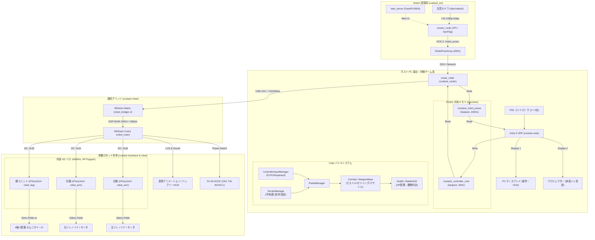

# CuStack-Robo (ｶｽﾀｯｸﾛﾎﾞ) プロジェクト全体仕様・統合アーキテクチャ

本ドキュメントは、**CuStack-Robo (ｶｽﾀｯｸﾛﾎﾞ)** システムの全体像、各サブシステム（Hardware / Firmware / ROS 2 / Unity）の仕様、およびモジュール間連携プロトコルをまとめた統合仕様書です。

---

## 1. 概要

**CuStack-Robo** は、床面プロジェクションマッピング演出と小型自律/遠隔制御ロボットがリアルタイムにインタラクションする複合ゲーム・ロボットシステムです。

- **カメラ認識・位置推定 (Jetson / ROS 2 Humble)**: 天頂カメラ映像から NVIDIA VPI を用いて歪み補正・透視変換を行い、AprilTag (16H5) により最大60Hzで複数台ロボットの絶対位置姿勢を推定。
- **共有メモリ・通信中継 (Host PC / C++)**: POSIX 共有メモリ（Seqlock 方式）を介して Unity と超低遅延（>200Hz）で座標共有。Unity からの操作指令を 3ch シリアル通信（115200bps）で M5Atom ブリッジへ転送。
- **演出・バトルゲーム制御 (Host PC / Unity 6 URP)**: 2画面出力（PC管理画面 / プロジェクター床面投影）。リアルタイム位置追従、装備（アーム武器・脚特性）×地形効果（泥・氷・溶岩等）による挙動変化、誘導ミサイルや弾幕を含むバトルゲームシステムとHUD。
- **実機ロボット制御 (M5Stack Core2 + ATtiny1614 x3)**: ESP-NOW（100Hz）無線通信で指令を受信し、内部 I2C バス経由で 4 輪オムニホイール（`robot_leg`）および左右アーム（`robot_arm`）を高精度分散制御。攻撃時には実機ソレノイド/モーターが同期作動。
- **専用ハードウェア基板 (KiCad v10)**: 2S Li-ion 電源回路、6A 大電流 DCDC、M5Stack スタック用メイン基板、ポゴピン接続可能な 3 種の子局基板（パネライゼーション設計）。

---

## 2. システム全体アーキテクチャ & データフロー



---

## 3. ディレクトリ構成 & サブエージェント体制

本リポジトリは 4 つの専門領域にモジュール化されており、それぞれ専任のサブエージェントが管理しています。

| ディレクトリ | 専任サブエージェント | 主な技術スタック | 管理領域・担当機能 | 詳細仕様書 |
| :--- | :--- | :--- | :--- | :--- |
| **`custack-hardware/`** | `agent-hardware` | KiCad v10, 回路・CAD | メイン基板、電源基板、アーム/脚基板、ポゴピン配置、回路設計 | [`custack-hardware/GEMINI.md`](file:///home/dai_guard/Workspaces/custack-robo/agent/custack-hardware/GEMINI.md) |
| **`custack-robot/`** | `agent-robot` | PlatformIO, C++, ATtiny | M5Stack Core2 メイン、M5Atom ブリッジ、ATtiny1614 脚・腕制御 | [`custack-robot/GEMINI.md`](file:///home/dai_guard/Workspaces/custack-robo/agent/custack-robot/GEMINI.md) |
| **`custack_ws/`** | `agent-ros` | ROS 2 Humble, C++, Python | VPI 画像処理・位置推定、共有メモリルーター、キャリブレーション Web | [`custack_ws/GEMINI.md`](file:///home/dai_guard/Workspaces/custack-robo/agent/custack_ws/GEMINI.md) |
| **`custack-unity/`** | `agent-unity` | Unity 6, URP, C#, Input System | プロジェクション演出、共有メモリ連携、対戦バトルシステム、装備×地形効果 | [`custack-unity/GEMINI.md`](file:///home/dai_guard/Workspaces/custack-robo/agent/custack-unity/GEMINI.md) |

---

## 4. サブモジュール詳細仕様

### 4.1 ハードウェア・回路設計 (`custack-hardware`)
- **パネライゼーション設計**: 5 種の基板（バッテリー、メイン、脚、右腕、左腕）を 1 枚の 2 層 FR4 パネル（1.6mm厚）に面付け。
- **電源構成**: 18350 2S Li-ion（7.4V/8.4V）→ P-MOSFET ハイサイドスイッチ → 村田 6A DCDC (`OKL-T/6-W12N-C`, 5V) & TI 2A DCDC (`TPS562200`, 3.3V)。
- **モジュール着脱**: 各末端基板（脚・アーム）とはマグネット/ポゴピン 4P（VDD 5V, SCL, SDA, GND）で接続。

### 4.2 実機制御ファームウェア (`custack-robot`)
- **`robot_bridge` (M5Atom Matrix)**: USB CDC ASCII コマンド（`SET,vx,vy,omega,arm_r,arm_l\n`）を受信し、ESP-NOW パケット（16Byte）を 100Hz で Core2 へ無線送信。5x5 RGB LED で通信ステータスを可視化。
- **`robot_main` (M5Stack Core2)**: Dual Core 構成（Core 0: 表情描画/バッテリー監視/HUD、Core 1: ESP-NOW 受信 & I2C 周期配信）。低電圧警告・電源フェールセーフ完備。
- **`robot_leg` (ATtiny1614: 0x30)**: 4 輪 X 配置オムニホイールのキネマティクス演算、ニュートラルオフセット保持（EEPROM）、50Hz PWM 出力。
- **`robot_arm` (ATtiny1614: 0x31/0x32)**: TCA0 Split Mode による 20kHz 高周波 PWM 駆動。単発パルス・点滅振動パターン制御。

### 4.3 ROS 2 ワークスペース (`custack_ws`)
- **`custack_locator_cpp`**: Jetson 専用。V4L2 から Y16 1080p 映像を取得し、NVIDIA VPI（LDC 歪み補正・透視変換・リサイズ）と AprilTag 検出により 60Hz で `/robot_poses` を配信。
- **`custack_router`**: ホスト PC 専用。`/robot_poses` を POSIX 共有メモリ `/custack_robot_poses` へ Seqlock 書き込み。同時に Unity から `/custack_controller_cmd` を読み込み、3 台の M5Atom へシリアル転送。
- **`custack_web`**: Jetson 上のキャリブレーション Web UI サーバー（Port 8000）。露出調整、4x5 円グリッド歪み校正、ArUco ホモグラフィ校正をブラウザで実行可能。

### 4.4 Unity 演出・ゲーム制御・共有メモリ連携 (`custack-unity`)
8 つの機能モジュール（`SharedMemory`, `Equipment`, `Input`, `Terrain`, `Combat`, `Robot`, `UI`, `Core`）による本格的なプロジェクション対戦ゲームシステム。

#### ① バトルメカニクス・武器システム (`Combat` & `Equipment`)
* **ピストル (`0x01`)**: 高速レーザー弾（威力 25, 弾速 25, 単発）
* **ガトリング (`0x02`)**: 拡散連射弾幕（威力 8, 15発/秒, 拡散角 $\pm 7.5^\circ$）
* **ミサイル (`0x03`)**: 誘導追尾・範囲爆発弾（威力 60, 追尾角速度 $120^\circ/\text{s}$, 爆発半径 1.8m）
* **実機連動**: 武器発射時に `HardwareArmFlag = 1` を立て、実機ソレノイド/モーターを同期駆動。

#### ② 脚ユニット特性 × 地形システム (`Terrain`)
| 脚ユニット | 平地 (`Normal`) | 森 (`Forest`) | 泥 / 沼 (`Mud`) | 氷 (`Ice`) | 溶岩 (`Lava`) | 移動挙動の特徴 |
| :--- | :--- | :--- | :--- | :--- | :--- | :--- |
| **`0x01: Omni`** | 速度: `100%` | 速度: `50%` | 速度: `30%` | 速度: `100%`<br/>スリップ: **`0.85` (大)** | ダメージ軽減: `0%` | 全方向自由スライド |
| **`0x02: Tire`** | 速度: **`125%` (最速)** | 速度: `40%` | 速度: `20%` (スタック) | 速度: `110%`<br/>スリップ: **`0.60` (ドリフト)** | ダメージ軽減: `0%` | 前後高速・鋭い旋回 |
| **`0x03: Crawler`** | 速度: `90%` | 速度: **`85%` (走破)** | 速度: **`80%` (走破)** | 速度: `85%`<br/>スリップ: **`0.20` (安定)** | ダメージ軽減: **`60%` カット** | 超信地旋回、**悪路無効化** |

#### ③ 超低遅延共有メモリ & 入力管理
- **Seqlock 共有メモリ**: `SharedMemoryReader` (200Hz 読出) と `SharedMemoryWriter` (50Hz 書込) により Unity ↔ C++ 間を 1ms 未満で同期。
- **入力系**: PS5 DualSense 2台 (P1/P2) 自動認識、スティック補正、ロックオン切替 (△ボタン)、キーボードフォールバック。

---

## 5. モジュール間通信プロトコル

### 5.1 POSIX 共有メモリ (C++ ↔ Unity 連携)
- メモリ名: `/custack_robot_poses` (Pose), `/custack_controller_cmd` (Command)
- 同期方式: **Seqlock**（ロックフリー・シーケンスロック、偶数: 確定 / 奇数: 更新中）
- メモリレイアウト: `pack=1` で C++ / C# 完全一致。

### 5.2 シリアルプロトコル (Host PC ↔ M5Atom ブリッジ)
- 通信速度: 115200 bps, 8N1
- 主要コマンド:
  - `SET,vx,vy,omega,arm_r,arm_l\n`: 全軸速度 (-1000〜1000) およびアーム起動 (0/1) 一括更新
  - `STP\n`: 全停止（フェールセーフ自動送信）
  - `STS\n`: ステータス問い合わせ
  - `TGT,XX:XX:XX:XX:XX:XX\n`: 宛先 Core2 MAC アドレス更新・EEPROM 保存

### 5.3 ESP-NOW プロトコル (M5Atom ↔ M5Stack Core2)
- 周波数: 2.4GHz Wi-Fi Ch 1, 送信レート: 100Hz
- パケット長: 16 Bytes 固定（Vx, Vy, Omega, ArmR, ArmL, Reserved[7], Watchdog）

### 5.4 I2C バスプロトコル (M5Stack Core2 ↔ ATtiny1614)
- クロック: 10kHz〜400kHz
- アドレス: `0x30` (脚), `0x31` (右腕), `0x32` (左腕)
- レジスタ:
  - `0x00`: デバイスID, `0x01`: FWバージョン, `0x02`: ウォッチドッグ
  - `0x10〜0x15`: 脚ユニット Vx/Vy/Omega (int16_t 各2Byte)
  - `0x10〜0x11`: アームユニット Duty/Pattern (uint8_t)

---

## 6. クイックスタート & 実行手順

### 1. Jetson 環境 (位置推定・カメラ認識 & Web UI)
```bash
cd custack_ws
./build_jetson.sh        # クリーン＆ビルド
./run_locator.sh         # 位置推定ノード起動
# 別ターミナルで Web UI 起動 (http://<Jetson-IP>:8000)
./run_web.sh
```

### 2. ホスト PC 環境 (ルーター & Unity)
```bash
cd custack_ws
./build_host.sh          # クリーン＆ビルド
./run_router.sh          # 共有メモリ・シリアルルーター起動
```
Unity Hub から `custack-unity` を開き、`Assets/_Project/Scenes/Main/Main.unity` を実行します。
（※単体テスト時は `Assets/_Project/Scenes/Sandbox/SharedMemorySandbox.unity` を使用）

### 3. ロボットファームウェア書き込み (PlatformIO)
```bash
cd custack-robot
# ブリッジユニット書き込み (M5Atom)
pio run -d robot_bridge -t upload --upload-port /dev/ttyUSB0

# メインユニット書き込み (M5Stack Core2)
pio run -d robot_main -t upload --upload-port /dev/ttyUSB0

# 脚ユニット書き込み (ATtiny1614)
pio run -d robot_leg -t fuses -t upload --upload-port /dev/ttyUSB0

# 左右アーム書き込み (ATtiny1614)
pio run -d robot_arm -e arm_right -t fuses -t upload --upload-port /dev/ttyUSB0
pio run -d robot_arm -e arm_left -t fuses -t upload --upload-port /dev/ttyUSB0
```

---

## 7. 重要決定事項 & 次のステップ

1. **シリアルポートの udev 固定化**:
   - ホスト PC 上の `/dev/ttyUSB0..2` の動的入れ替わりを防ぐため、udev rules（シリアル番号または物理 USB ポート固定）を整備。
2. **双方向テレメトリ通信の拡張**:
   - M5Stack Core2 からバッテリー電圧・子局ヘルス情報を ESP-NOW 経由でホスト側・Unity HUD へフィードバックする機能の実装。
3. **Unity プロジェクションマッピング幾何補正**:
   - プロジェクター設置角度による台形歪み・レンズ歪みを補正する Keystone 補正シェーダー/グリッド調整機能の追加。
4. **オクルージョン対策**:
   - AprilTag が一時的に隠れた際の速度慣性補間（デッドレコニング）アルゴリズムの高度化。
