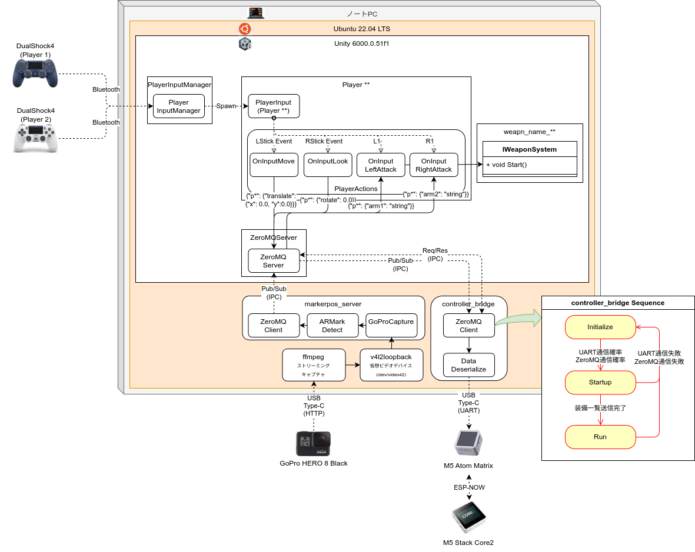

# ｶｽﾀｯｸﾛﾎﾞ(Custack-robo)

custack-roboのゲーム演出をするためのプログラムです
Unityで構成されていて、Unityゲーム画面をプロジェクタで投影して、ロボットのバトル描画を行う


---

## 仕様

- プレーヤごとにゲームオブジェクトが存在します
- プレーヤには2つの武器をもたせることができます
- その武器はデータベース内から選択できるようにします
- それぞれの武器はRightAttackEvent, LeftAttackEventのイベントでアニメーションを開始する
- 相手プレーヤに当たったときにエフェクトを発生させます
- 相手プレーヤに当たったら相手のHPを装備した武器の攻撃力に合わせて減らします
- プレーヤはフィールドZ=0に設置したプレート上を移動します
- フィールドプレート上に池や芝生など移動を阻害する状態を作る


## システム構成



## フォルダ構成

```tree
.
├── custack-unity/     #custackゲームプロジェクト
├── custack-agent/     # custackロボット内プログラム
├── custack-host/      # custackロボットへのデータ送信機用プログラム
├── markerpos_server/  # マーカ位置を検出するサーバー
├── docs/              # ドキュメント
└── README.md
```

## 管理ルール

- 各フォル内の作業は専用のブランチ内で作業を実施する

    - agent: custack-agent作業用
    - host: custack-host作業用
    - unity: custack-unity作業用
    - server: markerpos_server作業用

- 作業が完了したらdevelopにマージを実施する
- developブランチで動作が確認できたらmainにマージを実施する


## ToDoリスト

- [ ] フォルダ構成とgit管理を決める

## 仕様検討AIチャット

[Gemini](https://gemini.google.com/share/96ba88a5b598)
