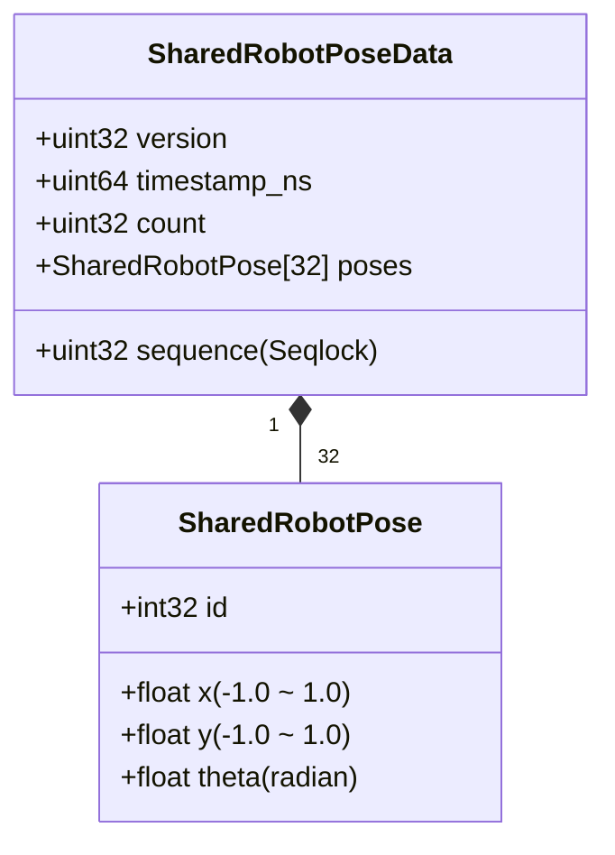

# Unity 共有メモリデータ確認 & ロボット3台位置姿勢インスペクター表示 実装計画書

`aiplan/custack_router_plan.md` の共有メモリ仕様に基づき、Unity 上で `/dev/shm/custack_robot_poses` からロボット3台分の位置姿勢（AprilTag ID 0, 1, 2）を取得し、インスペクター上でリアルタイムに確認できる C# プログラムを実装します。

---

## 🎯 目的と概要

* **背景**:
  * `custack_router` (C++) が Jetson から受信した `/robot_poses` を Seqlock ロックフリーで共有メモリ `/dev/shm/custack_robot_poses` に書き込む。
  * Unity 側で共有メモリ通信が正しく行われているか、3台のロボットの位置・回転・受信レート・Seqlock 状態をインスペクター上で視覚的かつリアルタイムにデバッグ確認したい。
* **達成目標**:
  1. **専用デバッグコンポーネント `SharedMemoryPoseViewer.cs` の作成**:
     * 依存関係なしで任意の GameObject にアタッチして即座に動作するスタンドアロンな確認スクリプト。
     * ロボット3台分（ID 0, 1, 2）の位置・回転（rad/deg）・検出フラグ・経過時間をインスペクター上に表示。
     * 共有メモリ全体のステータス（接続状態、シーケンス番号、タイムスタンプ、検出総数、受信Hz）を表示。
     * Scene ビュー上でのギズモ表示（位置と向きの可視化）に対応。
     * オプションでシーン上の Transform への自動反映にも対応。
  2. **既存 `SharedMemoryManager.cs` のインスペクター表示機能の拡張**:
     * 既存のマネージャークラスでもインスペクターから同様に3台分の位置姿勢が確認できるよう `[SerializeField]` なデバッグ表示フィールドを追加。

---

## 🏗️ 共有メモリ・データレイアウト照合

| フィールド | 型 | 説明 |
| :--- | :--- | :--- |
| `version` | `uint32` | プロトコルバージョン (`1`) |
| `sequence` | `uint32` | Seqlock (奇数: 書き込み中, 偶数: 確定) |
| `timestamp_ns` | `uint64` | ナノ秒タイムスタンプ |
| `count` | `uint32` | 検出台数 (0 〜 32) |
| `poses[i]` | `SharedRobotPose` | 各機体の `id`, `x`, `y`, `theta` |

---

## 📋 変更・追加ファイル

### 1. `custack-unity/Assets/Scenes/MultiDisplayProjects/Scripts/SharedMemoryPoseViewer.cs` [NEW]
* **パス**: `custack-unity/Assets/Scenes/MultiDisplayProjects/Scripts/SharedMemoryPoseViewer.cs`
* **機能**:
  * `RobotPoseDisplay` クラス (`[System.Serializable]`):
    * `targetId`: 監視対象ID (0, 1, 2)
    * `isDetected`: 検出フラグ
    * `rawShmPosition`: 共有メモリ正規化座標 (-1.0 〜 1.0)
    * `rawShmThetaRad`, `rawShmThetaDeg`: 共有メモリ回転角 (rad / deg)
    * `unityPosition`: Unity座標系換算後の (X, Y)
    * `unityRotationDeg`: Unity座標系換算後の Z回転角
    * `lastDetectedTime`: 最終検出時刻
  * `ShmStatusInfo` クラス (`[System.Serializable]`):
    * `isConnected`, `shmPath`, `protocolVersion`, `sequenceNumber`, `totalDetectedCount`, `receiveRateHz`
  * 毎フレーム `Update()` で Seqlock 読み込みを行い、インスペクター用配列 `monitoredRobots[3]` を更新。
  * `OnDrawGizmos()` により Scene ビュー上で 3台の位置・向きを描画。

### 2. `custack-unity/Assets/Scenes/MultiDisplayProjects/Scripts/SharedMemoryManager.cs` [MODIFY]
* **パス**: `custack-unity/Assets/Scenes/MultiDisplayProjects/Scripts/SharedMemoryManager.cs`
* **変更点**:
  * インスペクター上でロボット3台の位置姿勢・受信ステータスを直接確認できるように `[SerializeField]` のデバッグ構造体フィールドと更新処理を追加。
