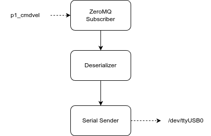

# controller_bridge

Unityで取得したコントローラ情報をコントローラホストへ送信するプログラム

---

## インストール方法

```bash
cd custack-robo/controller_bridge
python -m venv .venv
source .venv/bin/activate
pip install -e .
```

## 実行方法

```bash
cd custack-robo/controller_bridge
source .venv/bin/activate
controller_bridge -t p1_cmdvel -p /dev/ttyUSB0
```

## システム構成



## フォルダ構成

```tree
.
├── controller_bridge
├── README.md
├── requirements.txt
└── setup.py
```

