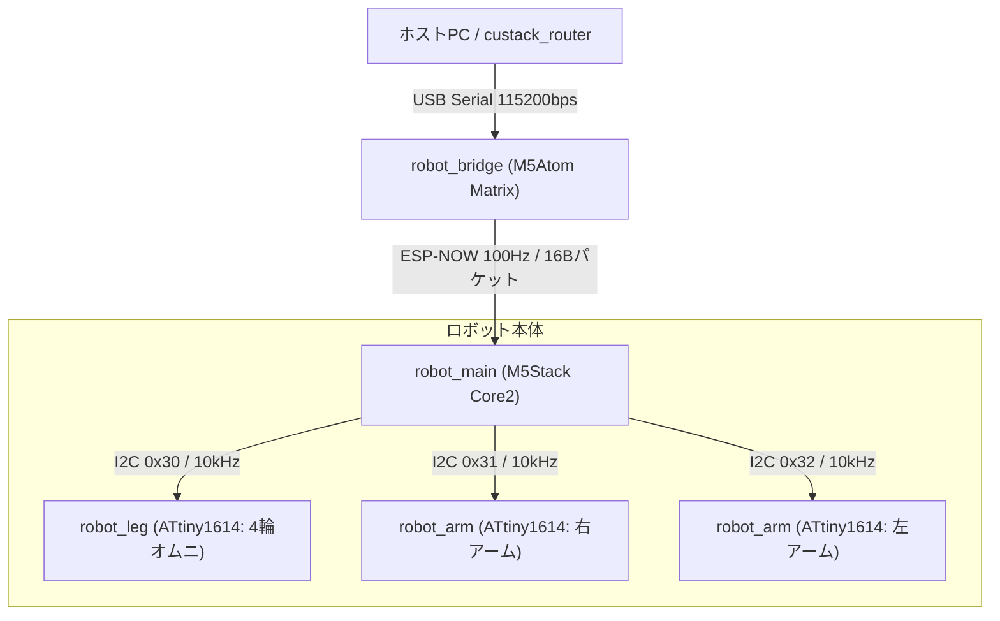
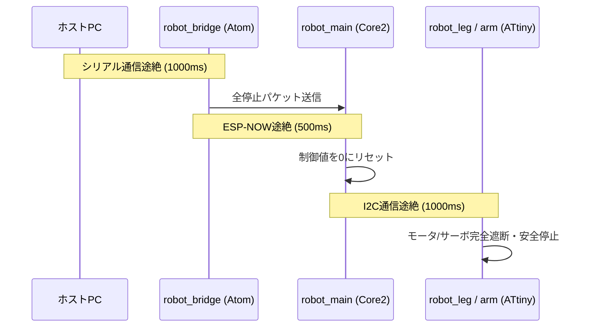

# custack-robot プロジェクト全体仕様

## 1. プロジェクト概要

`custack-robot` は、M5Stack Core2 をメイン統括ユニットとし、ESP-NOW による上位無線コマンド受信と、I2C 通信による子局（ATtiny1614 x 3 台）制御を行う対戦型小型ロボットの組み込みファームウェア群です。

---

## 2. システムアーキテクチャ & 通信フロー

### 通信プロトコル仕様
1. **上位無線通信 (ESP-NOW)**:
   - 固定長 16Byte バイナリパケット (`EspNowCommandPacket`)
   - 周期: 10ms (100Hz), チャンネル: 1 (`WIFI_STA`)
   - 制御パラメータ: `vx, vy, omega` (-1000〜1000), `arm_right, arm_left` (0:停止, 1:起動), `watchdog`
2. **ロボット内部バス (I2C)**:
   - 通信周波数: 10kHz (Master: Core2 / Slave: ATtiny1614)
   - スレーブアドレス:
     - `0x30`: 脚ユニット ([`robot_leg`](file:///home/dai_guard/Workspaces/custack-robo/unity/custack-robot/robot_leg/GEMINI.md)) - 4軸PWMオムニホイール制御
     - `0x31`: 右アームユニット ([`robot_arm`](file:///home/dai_guard/Workspaces/custack-robo/unity/custack-robot/robot_arm/GEMINI.md)) - 20kHz 高周波PWMモータ駆動
     - `0x32`: 左アームユニット ([`robot_arm`](file:///home/dai_guard/Workspaces/custack-robo/unity/custack-robot/robot_arm/GEMINI.md)) - 20kHz 高周波PWMモータ駆動

---

## 3. ディレクトリ構成 & コンポーネント一覧

| ディレクトリ | ターゲット MCU | 役割 | 仕様書 |
| :--- | :--- | :--- | :--- |
| [`robot_main/`](file:///home/dai_guard/Workspaces/custack-robo/unity/custack-robot/robot_main) | M5Stack Core2 | メイン統括、ESP-NOW受信、I2C配信、顔表情・UI描画、バッテリー監視・DCDC(5V)制御 | [GEMINI.md](file:///home/dai_guard/Workspaces/custack-robo/unity/custack-robot/robot_main/GEMINI.md) |
| [`robot_bridge/`](file:///home/dai_guard/Workspaces/custack-robo/unity/custack-robot/robot_bridge) | M5Atom Matrix | 送信ブリッジ、USB CDC シリアル ⇔ ESP-NOW 中継、5x5 LED 状態表示 | [GEMINI.md](file:///home/dai_guard/Workspaces/custack-robo/unity/custack-robot/robot_bridge/GEMINI.md) |
| [`robot_arm/`](file:///home/dai_guard/Workspaces/custack-robo/unity/custack-robot/robot_arm) | ATtiny1614 | アーム制御、20kHz PWM 出力、動作パターン制御 (右: `0x31`, 左: `0x32`) | [GEMINI.md](file:///home/dai_guard/Workspaces/custack-robo/unity/custack-robot/robot_arm/GEMINI.md) |
| [`robot_leg/`](file:///home/dai_guard/Workspaces/custack-robo/unity/custack-robot/robot_leg) | ATtiny1614 | 脚制御、4輪X配置オムニホイール PWM 出力、キネマティクス演算 (`0x30`) | [GEMINI.md](file:///home/dai_guard/Workspaces/custack-robo/unity/custack-robot/robot_leg/GEMINI.md) |
| [`tools/`](file:///home/dai_guard/Workspaces/custack-robo/unity/custack-robot/tools) | Python (Host) | ゲームパッド操作テスト (`test_gamepad.py`)、ブリッジ通信テスト (`test_bridge.py`) | - |

---

## 4. 統合安全保護・ウォッチドッグ体系

---

## 5. 推奨 AI モデル

- **全体設計・モジュール間連携タスク**: **Gemini 3.1 Pro**
- **各コンポーネント開発・個別不具合修正**: **Gemini 3.6 Flash**