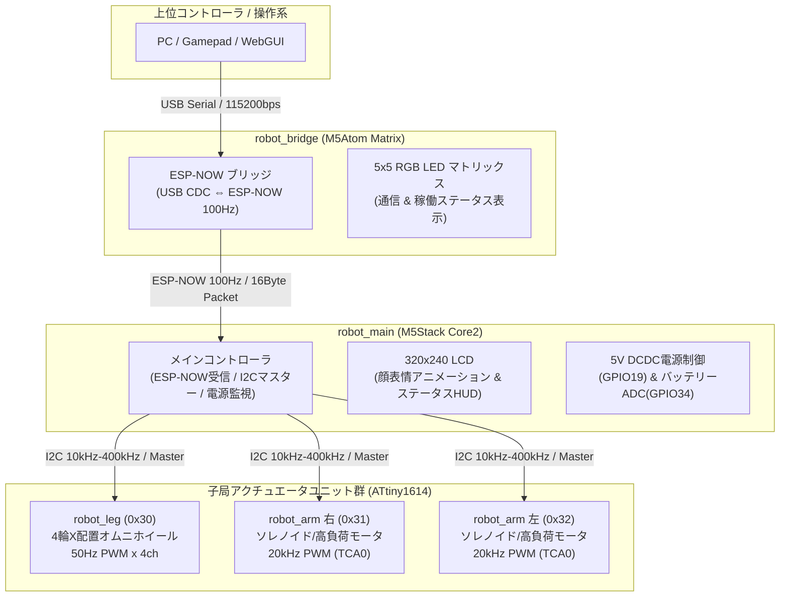

# custack-robot 実機ロボット制御・組込みファームウェア仕様書

本ディレクトリ (`custack-robot`) は、**CuStack ロボットシステム** における実機ロボット制御ファームウェアおよびテストツールの開発環境です。

---

## 1. 🏗️ システム全体アーキテクチャ

`custack-robot` は、**M5Stack Core2** をメイン統括ユニットとし、上位コントローラからの **ESP-NOW** 無線通信、および下位アクチュエータ子局群 (**ATtiny1614**) との **I2C** 有線通信によって構成される階層分散制御型ロボットシステムです。

### 1.1 システム構成図



### 1.2 ハードウェア構成 & マイコンの役割

| ユニット名 | ハードウェア / MCU | 通信 I/F | 役割・主な機能 |
| :--- | :--- | :--- | :--- |
| **`robot_bridge`** | M5Atom Matrix<br>(ESP32-PICO-D4) | USB CDC ⇔ ESP-NOW (Ch 1) | ホストのシリアルコマンドを受信し、Core2へESP-NOWパケットを高速転送 (100Hz)。5x5 RGB LEDで状態可視化。 |
| **`robot_main`** | M5Stack Core2<br>(ESP32-D0WDQ6-V3) | ESP-NOW ⇔ I2C (Master) | ロボット統括ユニット。パケット解析、表情・サウンド描画、バッテリー監視、5V電源制御、I2C子局への周期配信。 |
| **`robot_leg`** | ATtiny1614 | I2C Slave (`0x30`) | 4軸サーボ (オムニホイール) 制御ユニット。キネマティクス演算、EEPROMキャリブレーション、50Hz PWM出力。 |
| **`robot_arm` (右)** | ATtiny1614 | I2C Slave (`0x31`) | 右アーム制御ユニット。20kHz 高速PWM (TCA0 Split Mode) 出力、単発パルス/点滅振動パターン制御。 |
| **`robot_arm` (左)** | ATtiny1614 | I2C Slave (`0x32`) | 左アーム制御ユニット。右アームと共通FW、I2Cスレーブアドレスおよびパラメータのみ個別ビルド。 |

---

## 2. 📡 通信プロトコル & データ仕様

```text
[Host PC] 
   │  (1) USB CDC ASCII Command ("SET,100,200,0,1,0\n")
   ▼
[robot_bridge]
   │  (2) ESP-NOW 16Byte Binary Packet (100Hz 定期送信)
   ▼
[robot_main]
   │  (3) I2C Write / Auto-Increment (10kHz〜400kHz)
   ├───> [robot_leg (0x30)]  : 6Bytes (Vx, Vy, Omega) + 1Byte (WD)
   ├───> [robot_arm_r (0x31)]: 2Bytes (Duty, Pattern) + 1Byte (WD)
   └───> [robot_arm_l (0x32)]: 2Bytes (Duty, Pattern) + 1Byte (WD)
```

### 2.1 上位 ⇔ ブリッジ: シリアルコマンド仕様 (115200 bps, 8N1)

改行コード `\n` 区切りの大文字ASCIIテキスト形式。

| コマンド | 書式 | パラメータ範囲 | 応答 / レスポンス | 説明 |
| :--- | :--- | :--- | :--- | :--- |
| **`SET`** | `SET,vx,vy,omega,arm_r,arm_l` | `vx, vy, omega`: -1000〜1000<br>`arm_r, arm_l`: 0 または 1 | なし | 全軸速度および両アーム起動を一括更新 |
| **`VEL`** | `VEL,vx,vy,omega` | `vx, vy, omega`: -1000〜1000 | なし | 移動速度のみ更新 |
| **`ARM`** | `ARM,arm_r,arm_l` | `arm_r, arm_l`: 0 または 1 | なし | アーム動作状態のみ更新 |
| **`STP`** | `STP` | なし | なし | 全停止 (速度0, アーム停止) |
| **`STS`** | `STS` | なし | `STS,serial_st,espnow_st,vx,vy,omega,rarm,larm,wd` | 通信および制御ステータスを即時返信 |
| **`MAC`** | `MAC` | なし | `MAC,<OWN_MAC>,<TAG_MAC>` | 自身のMACとCore2宛先MACを返信 |
| **`TGT`** | `TGT,XX:XX:XX:XX:XX:XX` | MACアドレス文字列 | `TGT,XX:XX:XX:XX:XX:XX` | 送信先Core2のMACを更新しEEPROM保存 |
| **`PIN`** | `PIN` | なし | `PON` | 死活監視 (Ping) |

### 2.2 ブリッジ ⇔ メイン: ESP-NOW パケット仕様 (16Byte 固定長)

- **Wi-Fi モード**: `WIFI_STA` (Channel 1 固定)
- **送信周期**: 10ms (100Hz)
- **パケット構造**:
```cpp
#pragma pack(push, 1)
typedef struct {
    int16_t vx;          // 前後移動速度 (-1000 〜 +1000, 前進が正) [Little-Endian]
    int16_t vy;          // 左右移動速度 (-1000 〜 +1000, 右移動が正) [Little-Endian]
    int16_t omega;       // 旋回速度     (-1000 〜 +1000, 時計回りが正) [Little-Endian]
    uint8_t arm_right;   // 右アーム (0x00: 停止, 0x01: 起動)
    uint8_t arm_left;    // 左アーム (0x00: 停止, 0x01: 起動)
    uint8_t reserved[7]; // 予約パディング領域 (7 Bytes)
    uint8_t watchdog;    // 送信毎にインクリメントされる生存確認カウンタ
} EspNowCommandPacket;
#pragma pack(pop)
```

### 2.3 メイン ⇔ 子局: I2C 通信仕様 & レジスタマップ

- **バス**: Master: M5Stack Core2 (Port.A: SDA=GPIO32, SCL=GPIO33)
- **通信クロック**: 10kHz〜400kHz
- **アドレス一覧**:
  - `0x30`: 脚ユニット (`I2C_ADDR_LEG`)
  - `0x31`: 右アームユニット (`I2C_ADDR_ARM_RIGHT`)
  - `0x32`: 左アームユニット (`I2C_ADDR_ARM_LEFT`)

#### 共通レジスタ (全子局共通)
| アドレス | R/W | 型 | 初期値 | レジスタ名 | 説明 |
| :--- | :---: | :--- | :---: | :--- | :--- |
| `0x00` | R | `uint8_t` | 各種 | `REG_DEVICE_ID` | ユニット識別ID (0x01: 通常モード) |
| `0x01` | R | `uint8_t` | `0x10` | `REG_FW_VERSION` | ファームウェアバージョン (v1.0) |
| `0x02` | W | `uint8_t` | `0x00` | `REG_WATCHDOG` | MASTERが周期送信。500ms〜1000ms未更新で安全停止 |

#### 脚ユニット レジスタマップ (`0x30`)
| アドレス | R/W | 型 | 初期値 | レジスタ名 | 説明 |
| :--- | :---: | :--- | :---: | :--- | :--- |
| `0x10` | W | `int16_t` (L) | `0` | `REG_LEG_VX_L` | 前後速度 Vx 下位バイト |
| `0x11` | W | `int16_t` (H) | `0` | `REG_LEG_VX_H` | 前後速度 Vx 上位バイト (-1000〜1000) |
| `0x12` | W | `int16_t` (L) | `0` | `REG_LEG_VY_L` | 左右速度 Vy 下位バイト |
| `0x13` | W | `int16_t` (H) | `0` | `REG_LEG_VY_H` | 左右速度 Vy 上位バイト (-1000〜1000) |
| `0x14` | W | `int16_t` (L) | `0` | `REG_LEG_OMEGA_L` | 旋回速度 Omega 下位バイト |
| `0x15` | W | `int16_t` (H) | `0` | `REG_LEG_OMEGA_H` | 旋回速度 Omega 上位バイト (-1000〜1000) |
| `0x16`-`0x1D` | R/W | `int16_t x 4` | EEPROM | `REG_LEG_OFFSET1~4` | 各車輪のニュートラルオフセット (us単位) |
| `0x1E`-`0x21` | R/W | `uint8_t x 4` | EEPROM | `REG_LEG_SCALE1~4` | 各車輪のスケール係数 |

#### アームユニット レジスタマップ (`0x31`, `0x32`)
| アドレス | R/W | 型 | 初期値 | レジスタ名 | 説明 |
| :--- | :---: | :--- | :---: | :--- | :--- |
| `0x10` | W | `uint8_t` | `0` | `REG_ARM_DUTY` | 出力Duty比 (0〜255、内部で上限クランプ) |
| `0x11` | W | `uint8_t` | `0` | `REG_ARM_PATTERN` | 動作パターン (`0x00`: 手動, `0x01`: パルス, `0x02`: 点滅振動) |

---

## 3. 🛠️ ビルド & 書き込み手順 (PlatformIO)

```bash
# robot_bridge ビルド & 書込 (M5Atom Matrix)
pio run -d robot_bridge -t upload --upload-port /dev/ttyUSB0

# robot_main ビルド & 書込 (M5Stack Core2)
pio run -d robot_main -t upload --upload-port /dev/ttyUSB0

# robot_leg ビルド & 書込 (ATtiny1614: BOD 2.6V 設定)
pio run -d robot_leg -t fuses --upload-port /dev/ttyUSB0
pio run -d robot_leg -t upload --upload-port /dev/ttyUSB0

# robot_arm ビルド & 書込 (ATtiny1614: 右/左個別ビルド)
pio run -d robot_arm -e arm_right -t fuses --upload-port /dev/ttyUSB0
pio run -d robot_arm -e arm_right -t upload --upload-port /dev/ttyUSB0
pio run -d robot_arm -e arm_left -t fuses --upload-port /dev/ttyUSB0
pio run -d robot_arm -e arm_left -t upload --upload-port /dev/ttyUSB0

# テストツール実行 (PS5 DualSense / シリアルテスト)
pip install -r tools/requirements.txt
python3 tools/test_gamepad.py -p /dev/ttyUSB0 --max-speed 600 --max-omega 500
```