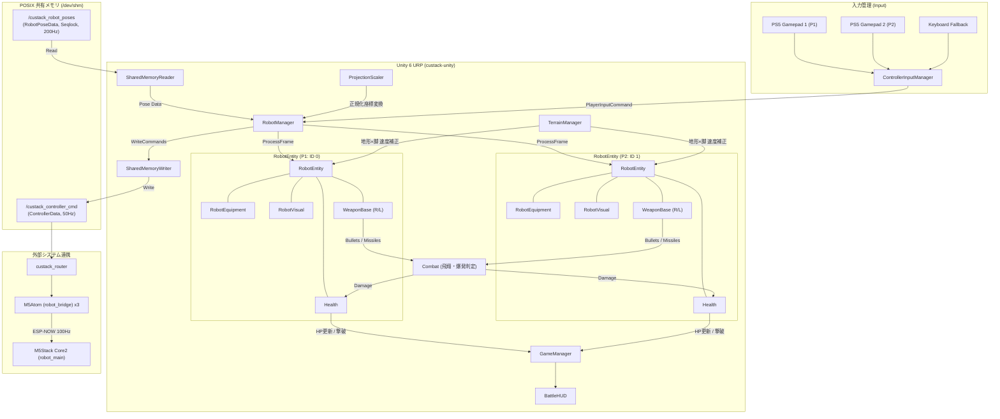

# custack-unity プロジェクト仕様書・バトルシステム設計

本ドキュメントは、**CuStack ロボットシステム** における Unity (Unity 6 / URP) プロジェクトの仕様書です。
床面プロジェクションマッピング演出、POSIX 共有メモリを介した超低遅延なロボット位置追従およびゲームパッド操作、実機アクチュエータ連動を伴うバトルゲームシステムを実装しています。

---

## 1. 🛠️ 環境・パッケージ構成

* **Unity バージョン**: `Unity 6 (6000.3.14f1)`
* **レンダーパイプライン**: Universal Render Pipeline (`URP 17.3.0`)
* **入力システム**: Unity Input System (`com.unity.inputsystem 1.19.0`)
* **マルチディスプレイ構成**:
  * **Display 1 (ホストPC メイン画面)**: `HostDashboardCamera` / `HostDashboardUI` (コントローラー割当、シリアルブリッジ信号、各機体テレメトリ・表示ON/OFF、ノイズ遮断プリセット、FPS)
  * **Display 2 (プロジェクター床面投影)**: `ProjectionCamera` / `BattleCanvas` (1:1 俯瞰プロジェクションマッピング、アリーナ、地形エフェクト、ロボット、弾幕・爆発演出)
* **設計アーキテクチャ**: 関心事の分離（SoC）に基づき機能モジュール化



---

## 2. 📁 ディレクトリ構成

```text
custack-unity/
└── Assets/
    ├── _Project/
    │   ├── Scenes/
    │   │   ├── Main/
    │   │   │   └── Main.unity              # 本番対戦・プロジェクションシーン
    │   │   └── Sandbox/
    │   │       └── SharedMemorySandbox.unity # 共有メモリ・装備単体テストシーン
    │   ├── Scripts/
    │   │   ├── Combat/                     # 戦闘・武器・飛翔体・HP
    │   │   │   ├── Health.cs
    │   │   │   ├── WeaponBase.cs
    │   │   │   ├── PistolWeapon.cs
    │   │   │   ├── GatlingWeapon.cs
    │   │   │   ├── MissileWeapon.cs
    │   │   │   ├── Projectile.cs
    │   │   │   ├── HomingMissile.cs
    │   │   │   ├── ExplosionArea.cs
    │   │   │   └── HitEffect.cs
    │   │   ├── Equipment/                  # 装備構成・パラメータ・ハード連動
    │   │   │   ├── DeviceIdEnums.cs
    │   │   │   ├── ArmWeaponConfig.cs
    │   │   │   ├── LegMovementConfig.cs
    │   │   │   └── RobotEquipment.cs
    │   │   ├── Input/                      # ゲームパッド・キーボード入力管理
    │   │   │   ├── ControllerInputManager.cs
    │   │   │   └── PlayerInputCommand.cs
    │   │   ├── Terrain/                    # 地形効果・ゾーン判定
    │   │   │   ├── TerrainType.cs
    │   │   │   ├── TerrainData.cs
    │   │   │   ├── TerrainZone.cs
    │   │   │   └── TerrainManager.cs
    │   │   ├── Robot/                      # ロボット統括・座標変換・描画
    │   │   │   ├── RobotEntity.cs
    │   │   │   ├── RobotManager.cs
    │   │   │   ├── RobotVisual.cs
    │   │   │   └── ProjectionScaler.cs
    │   │   ├── SharedMemory/               # POSIX共有メモリ Seqlock 送受信
    │   │   │   ├── SharedMemoryTypes.cs
    │   │   │   ├── SharedMemoryReader.cs
    │   │   │   └── SharedMemoryWriter.cs
    │   │   ├── UI/                         # バトルHUD・UI表示
    │   │   │   └── BattleHUD.cs
    │   │   └── Core/                       # ゲームループ・勝敗判定
    │   │       └── GameManager.cs
    │   ├── Materials/                      # レンダリング＆物理マテリアル
    │   ├── Prefabs/                        # プレハブアセット
    │   └── Textures/                       # テクスチャアセット
    └── Settings/                           # URP パイプライン設定
```

---

## 3. 📜 各モジュールの詳細仕様

### 3.1 共有メモリ通信 (`Custack.SharedMemory`)
C++ 側（`custack_ws/src/custack_router/include/custack_router/posix_shm.hpp`）とバイナリレイアウト（`Pack = 1`）が完全に一致。
* **`SharedMemoryTypes.cs`**:
  - `SharedRobotPose` (20 bytes, Pack=1): `id` (int), `x` (float), `y` (float), `theta` (float), `legId` (byte), `armRightId` (byte), `armLeftId` (byte), `status` (byte)
  - `SharedRobotPoseData` (656 bytes): `version`, `sequence` (Seqlock), `timestampNs`, `count`, `posesRaw[32 * 20]`
  - `SingleControllerCommand` (10 bytes, Pack=1): `vx`, `vy`, `omega` (short 各 -1000〜1000), `armRight`, `armLeft`, `active`, `reserved` (byte 各 1B)
  - `SharedControllerData` (100 bytes): `version`, `sequence`, `timestampMs`, `count`, `controllersRaw[8 * 10]`
* **`SharedMemoryReader.cs`**:
  - `/dev/shm/custack_robot_poses` を Seqlock ロックフリー（最大5回リトライ、偶数チェック、前後シーケンス一致検証）で読み取り。
* **`SharedMemoryWriter.cs`**:
  - `/dev/shm/custack_controller_cmd` へ全コントローラー指令を Seqlock 方式（`sequence += 2` で偶数維持）で書き込み。
* **`SharedMemoryDebugMonitor.cs`**:
  - 共有メモリ上のロボット位置姿勢・デバイスID・更新レート（Hz）を Game 画面上にリアルタイム HUD 表示するデバッグツール（`F1` キーでトグル）。

### 3.2 装備 & デバイスID管理 (`Custack.Equipment`)
* **`DeviceIdEnums.cs`**:
  - `ArmDeviceType`: `0x00: None`, `0x01: Gatling`, `0x02: Sword`, `0x03: Cannon`
  - `LegDeviceType`: `0x00: None`, `0x01: Omni`, `0x02: Tire`, `0x03: Crawler`
* **`ArmWeaponConfig.cs`**:
  - 武器パラメータ（ダメージ、弾速、射程/寿命、クールダウン、フルオート可否、拡散角、マテリアル色等）を定義。
* **`LegMovementConfig.cs`**:
  - 各脚の地形別速度・旋回適用比率（平地: 1.0, 泥: 0.2〜0.8, 森: 0.4〜0.85等）、スリップ慣性係数、溶岩ダメージ軽減率を定義。
  - ※ 差動二輪の横移動無効化や $V_x$ 連動ステアリング制御等のキネマティクス制限は実機マイコン（`robot_leg`）側で実行されるため、Unity 側では純粋に地形適用比率（0.0〜1.0）のみを管理。
* **`RobotEquipment.cs`**:
  - `overrideEquipment`: インスペクター手動オーバーライドトグル。実機なしの単体テストが可能。
  - `SetFromHardware`: 実機デバイスID受信時の動的切り替え。
  - `OnEquipmentChanged`: 変更時に武器コンポーネントを即時再構築。

### 3.3 入力管理 (`Custack.Input`)
* **`ControllerInputManager.cs`**:
  - **任意のロボット ID (AprilTag ID: 0〜15+) に対する入力ソース（Gamepad 0〜3, Keyboard P1/P2, None）の自由なマッピング・割り当て**に対応。
  - インスペクターおよび画面上 GUI（`F2` キーでトグル表示）から直感的に各ロボットの操作コントローラーを切り替え可能。
  - スティックのデッドゾーン補正（`0.15`）、L2/R2 によるアナログ旋回補助。
  - キーボードフォールバック:
    - **Keyboard P1**: 移動 `WASD`, 旋回 `Q/E`, 右武器 `J`, 左武器 `K`, ロックオン切替 `U`
    - **Keyboard P2**: 移動 `↑↓←→`, 旋回 `, .`, 右武器 `Numpad1`/`L`, 左武器 `Numpad2`/`;`, ロックオン切替 `Numpad5`/`P`
* **`PlayerInputCommand.cs`**:
  - 移動ベクトル（x: 左右, y: 上下）、旋回値、左右武器（単発/ホールド）、ターゲット切替フラグを保持。

### 3.4 地形効果 & 4大アリーナマップ (`Custack.Terrain`)
* **`TerrainType.cs`**: `Normal` (平地), `Forest` (森林/瓦礫 減速), `Mud` (泥沼/深雪/火山灰 大減速・足取られ), `Ice` (氷原 スリップ・低摩擦), `Lava` (溶岩/高圧電磁サージ スリップダメージ)
* **`TerrainMapManager.cs`**:
  - 4種類のプロジェクションマップ（🌲 森、🌋 火山、🏙️ 市街地、❄️ 雪山・氷山）の動的切替マネージャー（キーボード `1`〜`4` / `F5`〜`F8` キー）。
  - 各マップの背景テクスチャ（3:2 / 12m × 8m）および専用の当たり判定ポリゴンコライダー群を一括制御。
* **`TerrainData.cs`**: 地形基本パラメータ（速度/旋回倍率、秒間ダメージ、ギズモ色等）
* **`TerrainZone.cs`**: `PolygonCollider2D` / `BoxCollider2D` (Trigger) による精密なエリア侵入判定とギズモ描画
* **`TerrainManager.cs`**:
  - ロボット現在地の地形と脚ユニットの耐性比率（平地: 1.0）を掛け合わせ、実機コマンド（$-1000 \sim 1000$）を計算。キネマティクス制限は実機マイコンに委ね、Unity 側は純粋な地形比率計算に特化。
* **`TerrainSandboxController.cs`**:
  - サンドボックス環境でのリアルタイム走行物理・スリップ・ダメージ検証、脚ユニット（Omni / Tire / Crawler）即時切替、および **`[X] 当たり判定ポリゴン枠線を表示 (Collider Overlay)`** 機能。

### 3.5 戦闘・武器・弾丸システム (`Custack.Combat`)
* **`Health.cs`**: HP管理（最大 1000）、スタン蓄積（100ダメで1.5s移動停止）、無敵時間（2.0s / 外周円点滅）、撃破・リスポーンイベント
* **`WeaponBase.cs`**:
  - 武器基底クラス。発射時に `HardwareArmFlag = 1`（0.15秒保持）を立て、実機ソレノイド/モーターを連動駆動。撃破時（HP 0）およびスタン時は発射を完全遮断。
* **`GatlingWeapon.cs`** (`0x01`): 拡散連射弾幕（拡散角 $\pm 7.5^\circ$, 15発/s, 威力 8, 速度 16, 黄色マズルフラッシュ＋残光トレイル＋着弾火花）
* **`SwordWeapon.cs`** (`0x02`): 近接三日月スイング（威力 40, CD 0.45s, エメラルドグリーン三日月アーク発光メッシュ＋近接切断スパーク）
* **`LaserCannonWeapon.cs`** (`0x03`): 大型レーザーキャノン（威力 30, 速度 7.5, 寿命 3.5s, CD 1.8s, 青白チャージ閃光＋極太ブルービーム＋大爆発・衝撃波リング）
* **`Projectile.cs`**: 飛翔体基底、Raycast すり抜け防止 & 2D トリガーハイブリッド判定
* **`EffectFactory.cs` / `HitEffect.cs`**: URP 発光 Additive パーティクル、マズルフラッシュ、着弾火花、大爆発、衝撃波、大破黒煙・放電スパークの動的生成

### 3.6 ロボット統括 & 表示 (`Custack.Robot`)
* **`ProjectionScaler.cs`**:
  - 共有メモリ座標（$-1.0 \sim 1.0$, Y下正）と Unity 2D 投影面（X右正, Y上正, $\theta$ 度数反転）を相互変換。
* **`RobotEntity.cs`**:
  - 入力 ➔ ターゲット選択 ➔ 地形補正 ➔ 左右武器発射 ➔ 実機コマンド構築を一括処理。
  - HP 0（撃破）時は実機速度指令を 0（`vx=0, vy=0, omega=0, active=0`）に固定し完全停止。
  - △ボタンでの相手機体ロックオン巡回切替。
* **`RobotVisual.cs`**:
  - **AprilTag 番号（0〜15+）の機体中央テキスト描画**（機体回転時でも正位置上向きを維持）。
  - アバター描画、頭上 HP バー、被弾白点滅（0.1s）、スタン黄色放電点滅、無敵時間外周円点滅、大破時の暗赤色消灯点滅・黒煙エフェクト。
* **`RobotManager.cs`**:
  - 0〜15（最大32台）の全機体の座標同期、動的スロット確保・ランタイム自動生成 (`EnsureRobotSlot`)、入力配信、50Hz 周期での共有メモリ書き込みを統括。

### 3.7 ゲーム進行 & UI (`Custack.Core`, `Custack.UI`)
* **`BattleHUD.cs`**: P1/P2 HPゲージ（1000）、装備構成、勝利アナウンス表示。
* **`GameManager.cs`**: 勝敗判定、ラウンド管理、「R」キーおよびコントローラー「△」ボタンでの即時再戦リセット。

### 3.8 オーディオシステム & 音源プロシージャル生成 (`Custack.Audio`, `Tools/`)
* **`AudioManager.cs`**:
  - `[RuntimeInitializeOnLoadMethod]` によるシーン配置不要の自動常駐シングルトン（`DontDestroyOnLoad`）。
  - 16チャンネル SE 音声プール、ピッチ微小ランダム揺らぎ（連射SEの機械感を軽減）、同一SE短時間間引きリミッター。
  - マスター / SE / BGM の独立音量制御およびサイバーパンク BGM のシームレスループ再生。
  - **プロシージャル波形自動合成フォールバック**: 万が一オーディオファイルが見つからない環境でも `AudioClip.Create` によりリアルタイムで波形を合成して発音。
* **`Tools/generate_sound_effects.py`**:
  - Python 標準ライブラリ（`wave`, `struct`, `math`）のみで自立動作するプロシージャル音源生成ツール。
  - `Assets/_Project/Audio/` および `Assets/_Project/Resources/Audio/` へ全15種（SE 14種 + 4小節BGM 1種）を即座に生成・配置。
  - **収録サウンド一覧**:
    - `se_shot_gatling` (ガトリング連射), `se_shot_laser` (高出力レーザー), `se_sword_slash` (光刃スイング)
    - `se_hit_damage` (装甲被弾), `se_hit_shield` (無敵/バリア跳弾), `se_explosion` (重低音爆発), `se_stun` (電磁サージ放電), `se_defeat` (大破撃破)
    - `se_terrain_mud` (泥沼減速), `se_terrain_ice` (氷上スキッド), `se_terrain_lava` (溶岩スパーク)
    - `se_game_start` (ラウンド開始), `se_victory` (勝利ファンファーレ), `se_lockon` (ターゲット切替)
    - `bgm_battle_loop` (130BPM サイバーパンク メカバトル 4小節ループ)

---

## 4. 🎮 デバイスID & ゲームメカニクス対応表

### アームユニット (`ArmDeviceType`)
| デバイスID | 武器名 | 弾速 / 射程 | ダメージ / CD | 特徴 & 演出 |
| :--- | :--- | :--- | :--- | :--- |
| **`0x01`** | **ガトリング** | 16 (中速) / 0.7s (短射程) | 8 / 0.067s (15発/s) | 拡散角 $\pm 7.5^\circ$ の黄色弾幕連射、トレイル残光、火花スパーク |
| **`0x02`** | **ソード** | 近接スイング (半径 1.25m) | 40 / 0.45s (単発) | ロボット周辺の三日月型エメラルドグリーン斬撃スイング、切断スパーク |
| **`0x03`** | **大型レーザーキャノン** | 7.5 (重厚ビーム) / 3.5s (長射程) | 30 / 1.8s (ロングCD) | チャージ閃光、極太ブルーレーザービーム、着弾大爆発＋衝撃波リング |

### 脚ユニット (`LegDeviceType`) × 地形特性
| 脚ユニット | 平地 (`Normal`) | 森 (`Forest`) | 泥 / 沼 (`Mud`) | 氷 (`Ice`) | 溶岩 (`Lava`) | 移動挙動の特徴 |
| :--- | :--- | :--- | :--- | :--- | :--- | :--- |
| **`0x01: Omni`** | 速度: `100%` | 速度: **`50%`** | 速度: **`30%`** | 速度: `100%`<br/>スリップ: **`0.85` (大)** | ダメージ軽減: `0%` | 全方向自由スライド |
| **`0x02: Tire`** | 速度: **`125%` (最速)** | 速度: **`40%`** | 速度: **`20%` (スタック)** | 速度: `110%`<br/>スリップ: **`0.60` (ドリフト)** | ダメージ軽減: `0%` | 前後高速・鋭い旋回 ($V_x$制限) |
| **`0x03: Crawler`** | 速度: `90%` | 速度: **`85%` (走破)** | 速度: **`80%` (走破)** | 速度: `85%`<br/>スリップ: **`0.20` (安定)** | ダメージ軽減: **`60%` カット** | 超信地旋回、**悪路の影響を大幅無効化** |

---

## 5. 🖥️ シーン構成

1. **`Assets/_Project/Scenes/Main/Main.unity`**:
   - 本番対戦シーン（正視投影カメラ、P1/P2 ロボット、4大マップ切替、地形ゾーン、BattleHUD、全マネージャー完備）。
2. **`Assets/_Project/Scenes/Sandbox/TerrainEffectSandbox.unity`**:
   - 地形効果・4大マップ（森・火山・市街地・雪山）単体テストシーン（ポリゴンコライダー可視化、脚ユニット切替、走行テレメトリ計測）。
3. **`Assets/_Project/Scenes/Sandbox/WeaponEffectSandbox.unity`**:
   - 武器エフェクト・ダメージ計算・スタン・無敵点滅・HP0大破停止の単体テストシーン（ダミーターゲット完備）。
4. **`Assets/_Project/Scenes/Sandbox/SharedMemorySandbox.unity`**:
   - 共有メモリ送受信の単体デバッグ、インスペクター装備切替テスト用シーン。

---

## 6. 🚀 今後の課題・拡張ロードマップ

1. **マルチディスプレイ自動有効化スクリプトの再統合**:
   - Display 2 (プロジェクター床面投影) の自動アクティベーションおよび Display 1 (PC モニター HUD) とのデュアルカメラ構成。
2. **プロジェクション幾何歪み補正 (Keystone)**:
   - プロジェクター設置角度による台形歪みを補正する URP Keystone シェーダー/グリッド調整機能。
3. **URP VFX Graph & オーディオ演出の実装**:
   - 弾丸軌跡・爆発・被弾火花・オーラ演出の VFX 化および効果音/BGM。
4. **実機双方向テレメトリ通信**:
   - M5Stack Core2 からのバッテリー電圧・障害ステータスを Unity HUD にフィードバック。
