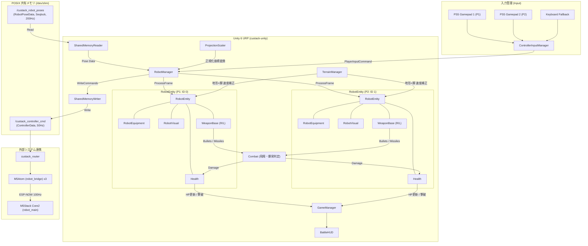

# custack-unity プロジェクト仕様書・バトルシステム設計

本ドキュメントは、**CuStack ロボットシステム** における Unity (Unity 6 / URP) プロジェクトの仕様書です。
床面プロジェクションマッピング演出、POSIX 共有メモリを介した超低遅延なロボット位置追従およびゲームパッド操作、実機アクチュエータ連動を伴うバトルゲームシステムを実装しています。

---

## 1. 🛠️ 環境・パッケージ構成

* **Unity バージョン**: `Unity 6 (6000.3.14f1)`
* **レンダーパイプライン**: Universal Render Pipeline (`URP 17.3.0`)
* **入力システム**: Unity Input System (`com.unity.inputsystem 1.19.0`)
* **設計アーキテクチャ**: 関心事の分離（SoC）に基づき 8 つの機能モジュールへモジュール化



---

## 2. 📁 ディレクトリ構成

```text
custack-unity/
└── Assets/
    ├── _Project/
    │   ├── Scenes/
    │   │   ├── Main/
    │   │   │   └── Main.unity              # 本番対戦・プロジェクションシーン
    │   │   └── Sandbox/
    │   │       └── SharedMemorySandbox.unity # 共有メモリ・装備単体テストシーン
    │   ├── Scripts/
    │   │   ├── Combat/                     # 戦闘・武器・飛翔体・HP
    │   │   │   ├── Health.cs
    │   │   │   ├── WeaponBase.cs
    │   │   │   ├── PistolWeapon.cs
    │   │   │   ├── GatlingWeapon.cs
    │   │   │   ├── MissileWeapon.cs
    │   │   │   ├── Projectile.cs
    │   │   │   ├── HomingMissile.cs
    │   │   │   ├── ExplosionArea.cs
    │   │   │   └── HitEffect.cs
    │   │   ├── Equipment/                  # 装備構成・パラメータ・ハード連動
    │   │   │   ├── DeviceIdEnums.cs
    │   │   │   ├── ArmWeaponConfig.cs
    │   │   │   ├── LegMovementConfig.cs
    │   │   │   └── RobotEquipment.cs
    │   │   ├── Input/                      # ゲームパッド・キーボード入力管理
    │   │   │   ├── ControllerInputManager.cs
    │   │   │   └── PlayerInputCommand.cs
    │   │   ├── Terrain/                    # 地形効果・ゾーン判定
    │   │   │   ├── TerrainType.cs
    │   │   │   ├── TerrainData.cs
    │   │   │   ├── TerrainZone.cs
    │   │   │   └── TerrainManager.cs
    │   │   ├── Robot/                      # ロボット統括・座標変換・描画
    │   │   │   ├── RobotEntity.cs
    │   │   │   ├── RobotManager.cs
    │   │   │   ├── RobotVisual.cs
    │   │   │   └── ProjectionScaler.cs
    │   │   ├── SharedMemory/               # POSIX共有メモリ Seqlock 送受信
    │   │   │   ├── SharedMemoryTypes.cs
    │   │   │   ├── SharedMemoryReader.cs
    │   │   │   └── SharedMemoryWriter.cs
    │   │   ├── UI/                         # バトルHUD・UI表示
    │   │   │   └── BattleHUD.cs
    │   │   └── Core/                       # ゲームループ・勝敗判定
    │   │       └── GameManager.cs
    │   ├── Materials/                      # レンダリング＆物理マテリアル
    │   ├── Prefabs/                        # プレハブアセット
    │   └── Textures/                       # テクスチャアセット
    └── Settings/                           # URP パイプライン設定
```

---

## 3. 📜 各モジュールの詳細仕様

### 3.1 共有メモリ通信 (`Custack.SharedMemory`)
C++ 側（`custack_ws/src/custack_router/include/custack_router/posix_shm.hpp`）とバイナリレイアウト（`Pack = 1`）が完全に一致。
* **`SharedMemoryTypes.cs`**:
  - `SharedRobotPose` (16 bytes): `id` (int), `x` (float), `y` (float), `theta` (float)
  - `SharedRobotPoseData` (536 bytes): `version`, `sequence` (Seqlock), `timestampNs`, `count`, `posesRaw[32 * 16]`
  - `SingleControllerCommand` (8 bytes): `vx`, `vy`, `omega` (short 各 -1000〜1000), `armRight`, `armLeft`, `active`, `reserved` (byte)
  - `SharedControllerData` (88 bytes): `version`, `sequence`, `timestampMs`, `count`, `controllersRaw[8 * 8]`
* **`SharedMemoryReader.cs`**:
  - `/dev/shm/custack_robot_poses` を Seqlock ロックフリー（最大5回リトライ、偶数チェック、前後シーケンス一致検証）で読み取り。
* **`SharedMemoryWriter.cs`**:
  - `/dev/shm/custack_controller_cmd` へ全コントローラー指令を Seqlock 方式（`sequence += 2` で偶数維持）で書き込み。

### 3.2 装備 & デバイスID管理 (`Custack.Equipment`)
* **`DeviceIdEnums.cs`**:
  - `ArmDeviceType`: `0x00: None`, `0x01: Pistol`, `0x02: Gatling`, `0x03: Missile`
  - `LegDeviceType`: `0x00: None`, `0x01: Omni`, `0x02: Tire`, `0x03: Crawler`
* **`ArmWeaponConfig.cs`**:
  - 武器パラメータ（ダメージ、弾速、射程/寿命、クールダウン、フルオート可否、拡散角、ホーミング角速度、爆発半径、マテリアル色等）を定義。
* **`LegMovementConfig.cs`**:
  - 各脚の基本速度/旋回倍率、横移動許可フラグ、地形別速度・旋回倍率、スリップ慣性係数、溶岩ダメージ軽減率を定義。
* **`RobotEquipment.cs`**:
  - `overrideEquipment`: インスペクター手動オーバーライドトグル。実機なしの単体テストが可能。
  - `SetFromHardware`: 実機デバイスID受信時の動的切り替え。
  - `OnEquipmentChanged`: 変更時に武器コンポーネントを即時再構築。

### 3.3 入力管理 (`Custack.Input`)
* **`ControllerInputManager.cs`**:
  - 2 台の PS5 Gamepad を自動認識して P1/P2 に割り当て。
  - スティックのデッドゾーン補正（`0.15`）、L2/R2 によるアナログ旋回補助。
  - キーボードフォールバック:
    - **P1**: 移動 `WASD`, 旋回 `Q/E`, 右武器 `J`, 左武器 `K`, ホーミング切替 `U`
    - **P2**: 移動 `↑↓←→`, 旋回 `, .`, 右武器 `Numpad1`/`L`, 左武器 `Numpad2`/`;`, ホーミング切替 `Numpad5`/`P`
* **`PlayerInputCommand.cs`**:
  - 移動ベクトル、旋回値、左右武器（単発/ホールド）、ターゲット切替フラグを保持。

### 3.4 地形効果 (`Custack.Terrain`)
* **`TerrainType.cs`**: `Normal`, `Forest`, `Mud`, `Ice`, `Lava`
* **`TerrainData.cs`**: 地形基本パラメータ（速度/旋回倍率、秒間ダメージ、ギズモ色等）
* **`TerrainZone.cs`**: `Collider2D` (Trigger) によるエリア判定とギズモ描画
* **`TerrainManager.cs`**:
  - ロボット現在地の地形と脚ユニット耐性を掛け合わせて移動値 $(V_x, V_y, \Omega)$ を複合補正。

### 3.5 戦闘・武器・弾丸システム (`Custack.Combat`)
* **`Health.cs`**: HP管理（100）、無敵時間（0.4s）、ダメージ・撃破・リスポーンイベント
* **`WeaponBase.cs`**:
  - 武器基底クラス。発射時に `HardwareArmFlag = 1`（0.15秒保持）を立て、実機ソレノイド/モーターを連動駆動。
* **`PistolWeapon.cs`**: 単発・高速・長射程レーザー弾（速度 25, 威力 25, CD 0.35s）
* **`GatlingWeapon.cs`**: 拡散連射弾幕（拡散角 $\pm 7.5^\circ$, 15発/s, 威力 8, 速度 16）
* **`MissileWeapon.cs`**: 誘導ミサイル（威力 60, 速度 9, CD 2.5s, 爆発半径 1.8m）
* **`Projectile.cs`**: 直線飛翔体基底、寿命・敵 Health 衝突判定
* **`HomingMissile.cs`**: `Mathf.MoveTowardsAngle` による滑らかな旋回追尾（$\omega = 120^\circ/\text{s}$）
* **`ExplosionArea.cs`**: 爆心地からの距離減衰を伴う範囲ダメージ発動
* **`HitEffect.cs`**: 被弾・爆発エフェクト生成

### 3.6 ロボット統括 & 表示 (`Custack.Robot`)
* **`ProjectionScaler.cs`**:
  - 共有メモリ座標（$-1.0 \sim 1.0$, Y下正）と Unity 2D 投影面（X右正, Y上正, $\theta$ 度数反転）を相互変換。
* **`RobotEntity.cs`**:
  - 入力 ➔ ターゲット選択 ➔ 地形補正 ➔ 左右武器発射 ➔ 実機コマンド構築を一括処理。
  - △ボタンでの相手機体ロックオン巡回切替。
* **`RobotVisual.cs`**:
  - アバター描画、頭上 HP バー、被弾白点滅（0.1s）、ロックオンレティクル表示。
* **`RobotManager.cs`**:
  - 全機体の座標同期、入力配信、50Hz 周期での共有メモリ書き込みを統括。

### 3.7 ゲーム進行 & UI (`Custack.Core`, `Custack.UI`)
* **`BattleHUD.cs`**: P1/P2 HPゲージ、装備構成、勝利アナウンス表示。
* **`GameManager.cs`**: 勝敗判定、ラウンド管理、「R」キーでの即時再戦リセット。

---

## 4. 🎮 デバイスID & ゲームメカニクス対応表

### アームユニット (`ArmDeviceType`)
| デバイスID | 武器名 | 弾速 / 射程 | ダメージ / CD | 特徴 & 演出 |
| :--- | :--- | :--- | :--- | :--- |
| **`0x01`** | **ピストル** | 25 (高速) / 3.0s (長射程) | 25 / 0.35s (単発) | 直線水色レーザー、マズルフラッシュ |
| **`0x02`** | **ガトリング** | 16 (中速) / 0.7s (短射程) | 8 / 0.067s (15発/s) | 拡散角 $\pm 7.5^\circ$ の黄色弾幕連射 |
| **`0x03`** | **ミサイル** | 9 (低速) / 4.0s (中射程) | 60 / 2.5s (ロングCD) | **緩やかな誘導追尾** ($\omega = 120^\circ/\text{s}$)、**着弾範囲爆発** (半径 1.8m) |

### 脚ユニット (`LegDeviceType`) × 地形特性
| 脚ユニット | 平地 (`Normal`) | 森 (`Forest`) | 泥 / 沼 (`Mud`) | 氷 (`Ice`) | 溶岩 (`Lava`) | 移動挙動の特徴 |
| :--- | :--- | :--- | :--- | :--- | :--- | :--- |
| **`0x01: Omni`** | 速度: `100%` | 速度: **`50%`** | 速度: **`30%`** | 速度: `100%`<br/>スリップ: **`0.85` (大)** | ダメージ軽減: `0%` | 全方向自由スライド |
| **`0x02: Tire`** | 速度: **`125%` (最速)** | 速度: **`40%`** | 速度: **`20%` (スタック)** | 速度: `110%`<br/>スリップ: **`0.60` (ドリフト)** | ダメージ軽減: `0%` | 前後高速・鋭い旋回 ($V_x$制限) |
| **`0x03: Crawler`** | 速度: `90%` | 速度: **`85%` (走破)** | 速度: **`80%` (走破)** | 速度: `85%`<br/>スリップ: **`0.20` (安定)** | ダメージ軽減: **`60%` カット** | 超信地旋回、**悪路の影響を大幅無効化** |

---

## 5. 🖥️ シーン構成

1. **`Assets/_Project/Scenes/Main/Main.unity`**:
   - 本番対戦シーン（正視投影カメラ、P1/P2 ロボット、地形ゾーン、BattleHUD、全マネージャー完備）。
2. **`Assets/_Project/Scenes/Sandbox/SharedMemorySandbox.unity`**:
   - 共有メモリ送受信の単体デバッグ、インスペクター装備切替テスト用シーン。

---

## 6. 🚀 今後の課題・拡張ロードマップ

1. **マルチディスプレイ自動有効化スクリプトの再統合**:
   - Display 2 (プロジェクター床面投影) の自動アクティベーションおよび Display 1 (PC モニター HUD) とのデュアルカメラ構成。
2. **プロジェクション幾何歪み補正 (Keystone)**:
   - プロジェクター設置角度による台形歪みを補正する URP Keystone シェーダー/グリッド調整機能。
3. **URP VFX Graph & オーディオ演出の実装**:
   - 弾丸軌跡・爆発・被弾火花・オーラ演出の VFX 化および効果音/BGM。
4. **実機双方向テレメトリ通信**:
   - M5Stack Core2 からのバッテリー電圧・障害ステータスを Unity HUD にフィードバック。
