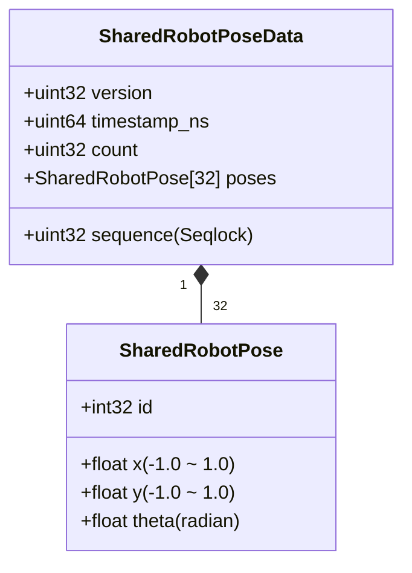

# custack-unity (Unity 6 / URP) プロジェクト仕様書

## 1. プロジェクト概要

- **Unity バージョン**: Unity 6 (`6000.3.14f1`)
- **レンダーパイプライン**: Universal Render Pipeline (URP 17.3.0)
- **入力システム**: Unity Input System (1.19.0)
- **役割**:
  - Jetson ➔ `custack_router` から **POSIX 共有メモリ (`/dev/shm/custack_robot_poses`)** 経由でロボット3台（AprilTag ID 0, 1, 2）の自己位置・姿勢角を Seqlock ロックフリーで超低遅延受信。
  - 実機ロボットの位置に合わせたプロジェクションマッピング演出・ゲーム描画。
  - インスペクター / Scene ビュー上でのリアルタイム姿勢デバッグ・ギズモ可視化。

---

## 2. ディレクトリ構成

プロジェクト内のアセットは `Assets/_Project/` 配下に集約して管理します。

```text
custack-unity/
├── Assets/
│   ├── _Project/
│   │   ├── Materials/       # マテリアル (Physics / Rendering)
│   │   ├── Models/          # 3Dモデルデータ
│   │   ├── Prefabs/         # プレハブ (ロボットアバター、エフェクト等)
│   │   ├── Scenes/          # シーンファイル
│   │   │   ├── Main/        # 本番ゲーム演出シーン (Main.unity)
│   │   │   └── Sandbox/     # デバッグ・検証用シーン (SharedMemorySandbox.unity)
│   │   ├── Scripts/         # C# スクリプト群
│   │   └── Textures/        # テクスチャ・スプライト
│   ├── Settings/            # URP レンダラー・パイプライン設定
│   └── Packages/            # Unity パッケージ構成 (manifest.json)
├── ProjectSettings/         # Unity プロジェクト設定
└── Packages/manifest.json
```

---

## 3. 共有メモリ連携アーキテクチャ

`custack_router` (C++) が書き込む POSIX 共有メモリを C# の P/Invoke / `MemoryMappedFile` を用いて Seqlock ロックフリーで読み取ります。

### 3.1. 共有メモリ・データ構造照合



| フィールド | 型 | 説明 |
| :--- | :--- | :--- |
| `version` | `uint32` | プロトコルバージョン (`1`) |
| `sequence` | `uint32` | Seqlock (奇数: 書き込み中, 偶数: 確定) |
| `timestamp_ns` | `uint64` | ナノ秒タイムスタンプ |
| `count` | `uint32` | 検出台数 (0 〜 32) |
| `poses[i]` | `SharedRobotPose` | 各機体の `id`, `x (-1.0〜1.0)`, `y (-1.0〜1.0)`, `theta (rad)` |

### 3.2. Seqlock 読み込みアルゴリズム
1. 共有メモリ先頭の `sequence` を読み取り（奇数なら書き込み中のため再試行）。
2. メモリバリアを挟み、データ本体（`count`, `poses`）を一括コピー。
3. 再度 `sequence` を読み取り、ステップ 1 と一致していればデータ整合性を保証。

---

## 4. 主要コンポーネント設計

- **`SharedMemoryManager`**:
  - `/dev/shm/custack_robot_poses` をオープンし、毎フレームの `Update()` で全機体の姿勢配列を更新。
  - 各 GameObject や演出スクリプトへ位置・姿勢データを提供する中央マネージャー。
- **`SharedMemoryPoseViewer`**:
  - インスペクターおよび Scene ビューデバッグ専用コンポーネント。
  - ロボット 3 台分（ID 0, 1, 2）の座標（正規化座標 / Unity ワールド座標）、回転角（rad / deg）、受信レート (Hz) をインスペクター上に表示。
  - `OnDrawGizmos()` による姿勢ギズモのリアルタイム描画。

---

## 5. 開発・動作確認手順

1. **ルーターノードの起動 (ホストPC)**:
   ```bash
   cd custack_ws
   ./run_router.sh
   ```
2. **Unity エディタでの動作確認**:
   - Unity 6 で `custack-unity` を開く。
   - `Assets/_Project/Scenes/Sandbox/SharedMemorySandbox.unity` を開いて再生。
   - インスペクター上でロボット 3 台の位置姿勢および受信レートが更新されていることを確認。
