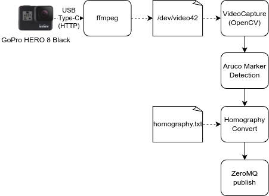

# markerpos_server

ARマーカの位置をUnityに送信するサーバ

---

## インストール方法

```bash
cd custack-robo/markerpos_server
python -m venv .venv
source .venv/bin/activate
pip install -e .
```

## 実行方法

### 1. キャリブレーションを実施する

プロジェクタの投光平面とカメラの位置を構成するためのキャリブレーションを行う
キャリブレーションに必要な4つのマーカをプロジェクタ投光面の四つ角へ置く


キャリブレーションアプリを起動する

```bash
cd custack-robo/markerpos_server
source .venv/bin/activate
homography_calc
```


<table>
    <tr>
        <td>S</td>
        <td>ホモグラフィ行列の保存<br>
        ※4つのマーカがすべて同時に写った瞬間に保存されます</td>
    </tr>
    <tr>
        <td>Q</td>
        <td>終了する</td>
    </tr>
    <tr>
        <td>T</td>
        <td>カメラの撮影を停止する</td>
    </tr>
</table>

### 2. マーカ位置サーバを起動する

```bash
cd custack-robo/markerpos_server
source .venv/bin/activate
markerpos_server
```

## システム構成



## フォルダ構成

```tree
.
├── homography.txt
├── markerpos_server
├── markerpos_server.egg-info
├── README.md
├── requirements.txt
└── setup.py
```